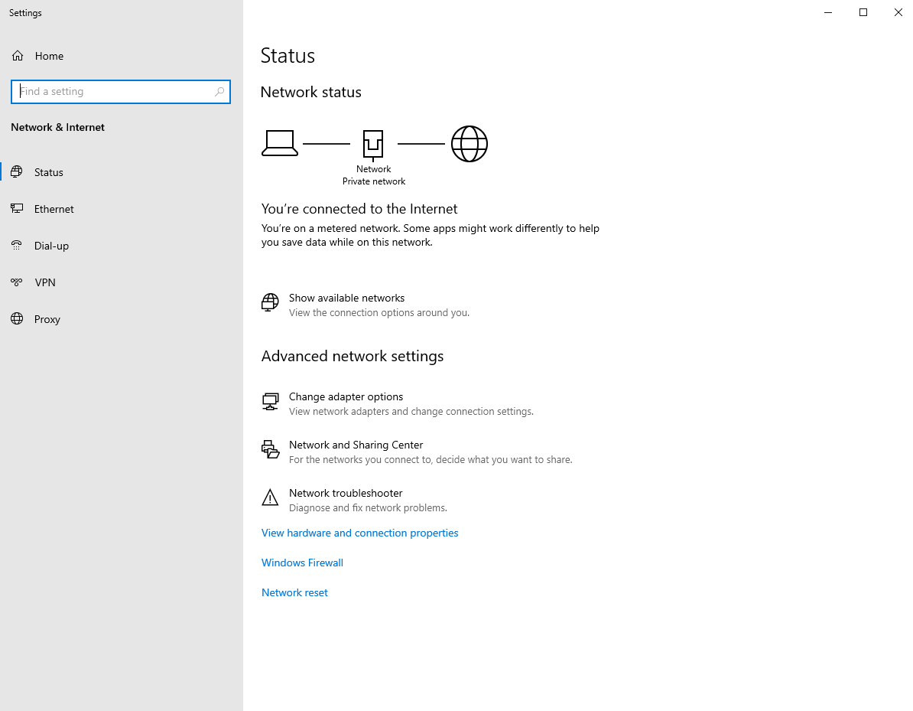

# Automated Active Directory Deployment & Domain Architecture

## Project Overview
This project simulates the complete bare-metal setup and configuration of a centralized corporate network infrastructure using VMware Workstation. 

---

## Step-by-Step Implementation

### Step 1: Configuring Server Static IP Network Settings
To ensure network consistency and reliable local name resolution, I manually configured the network adapter properties on the Windows Server 2022 instance, shifting it away from dynamic addressing to a permanent, static corporate layout matching the local hypervisor subnet gateway.
* **Key Configs:** IP `192.168.150.10`, Gateway `192.168.150.2`, DNS `192.168.150.10`

---

### Step 2: Promoting the Domain Controller & Creating the Forest
I installed the Active Directory Domain Services (AD DS) and DNS Server roles through Server Manager. Once installed, I promoted the instance to a Domain Controller, creating a brand new root-level active directory forest named `nexus.local`.

---

### Step 3: Automating Multi-Department Onboarding via PowerShell
Instead of manually creating accounts, I utilized PowerShell ISE to write an automation script. The script automatically built separate Organizational Units (OUs) for HR, IT, and Finance, parsed user data, and safely provisioned standard employee accounts with secure temporary passwords.

---

### Step 4: Activating Corporate DHCP Core Services
I deployed the DHCP Server role on the Domain Controller and created an active IP assignment scope. This ensures any corporate machine plugged into the network automatically receives an IP address within the valid `192.168.150.50 - .150` range while explicitly setting the server as their primary DNS director.

---

### Step 5: Client Workstation Domain-Join & Authentication
Booted up the Windows 11 Client VM, verified via `ipconfig` that it pulled a clean network configuration from the server's DHCP pool, and changed its system settings to join the `nexus.local` domain. I successfully logged in for the first time using a script-generated user profile.

