# Enterprise Secured File Infrastruce & Group Policy Lockdown

## Project Overview
This project simulates designing a Security Group with OUs, designing and implementing file shares via NTFS and shared permissions, deploying GPOs from the server, and configuring network drives and global lockout thresholds.

---

## Step-by-Step Implementation

### Step 1: Setting up a Security Group
To properly assign the appropriate file permissions for future steps, I created security groups corresponding to each department. The naming scale is not too difficult for better scalability if future departments are needed to be added. Each group was manually named then the OUs were linked to the group.

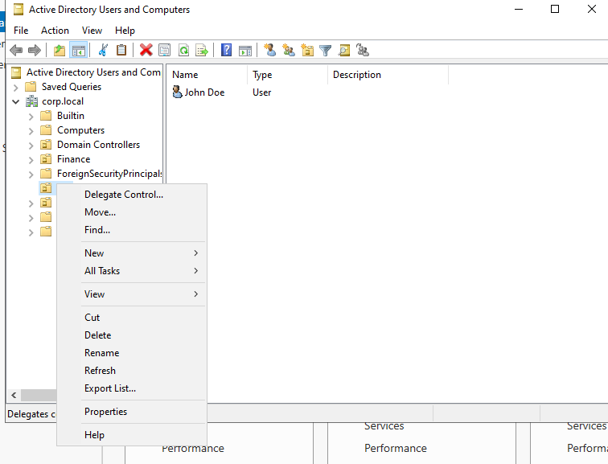

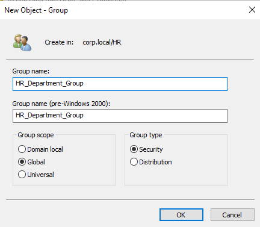

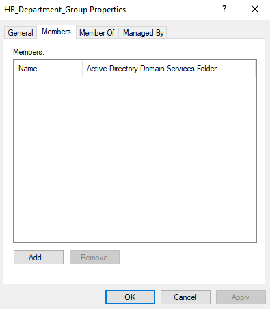

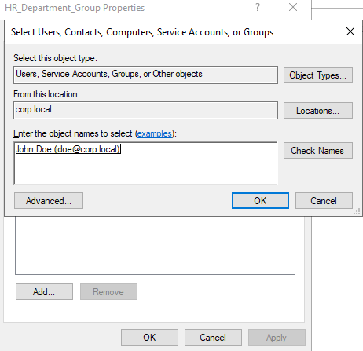

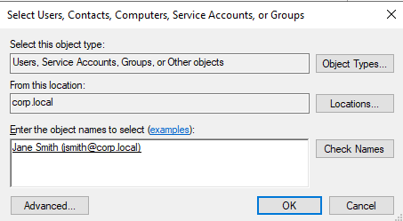

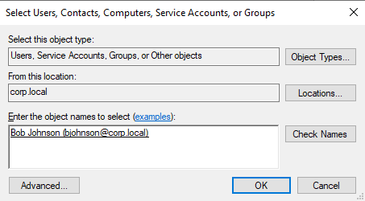

---

### Step 2: NTFS File Deployment
Advanced security permissions required me to delete each user using special permissions and ensuring each department was only given specific permission such as full control for the HR_Share folder for only the HR department. Each limitation was tested in the last step.

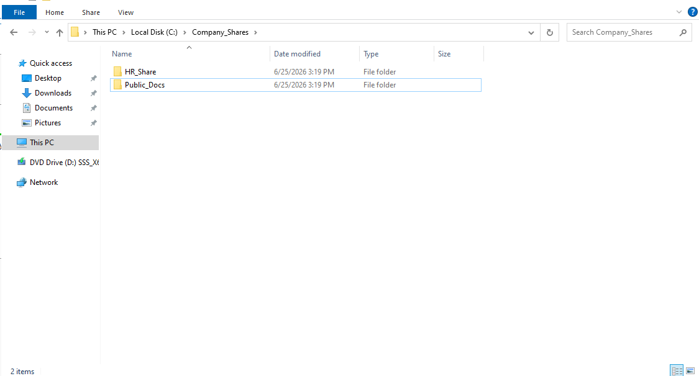

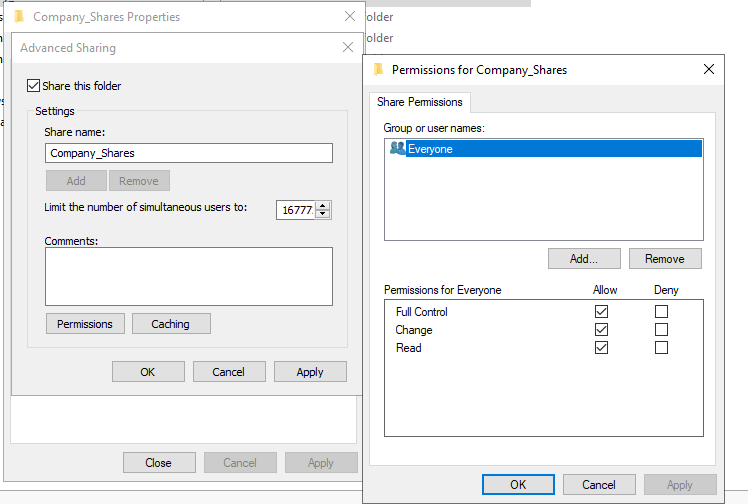

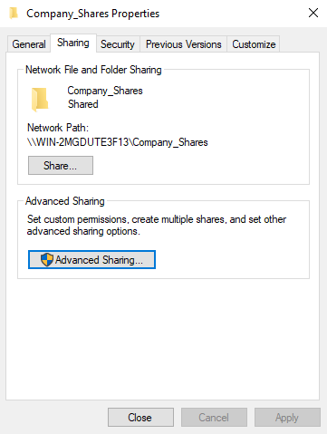

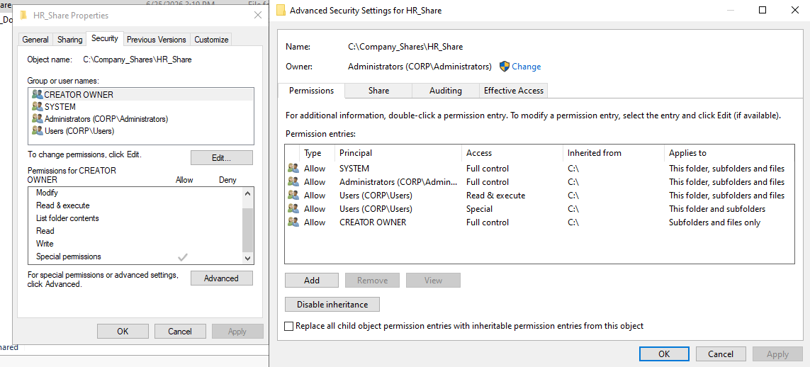

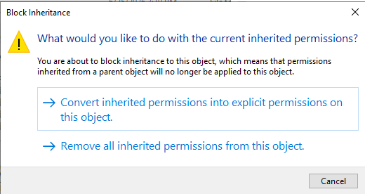

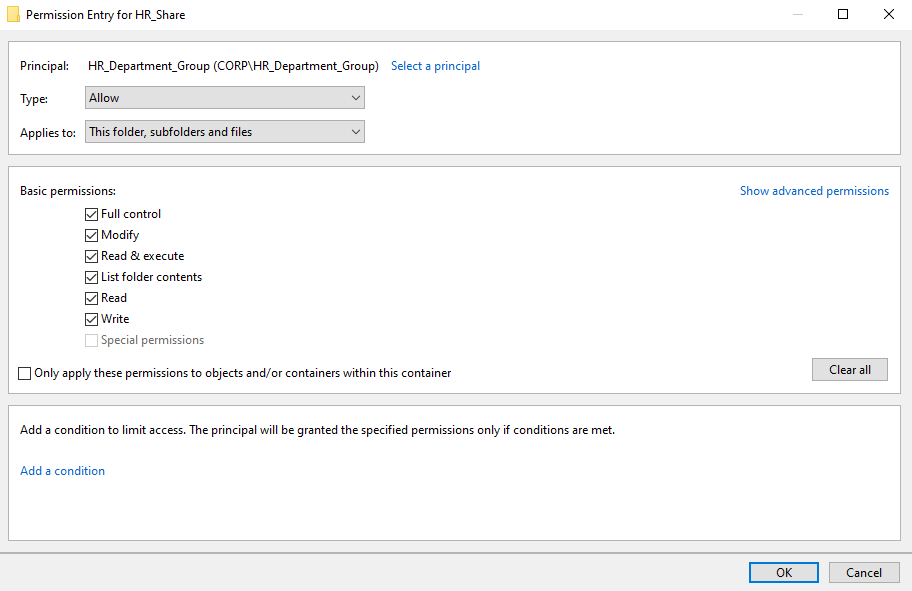

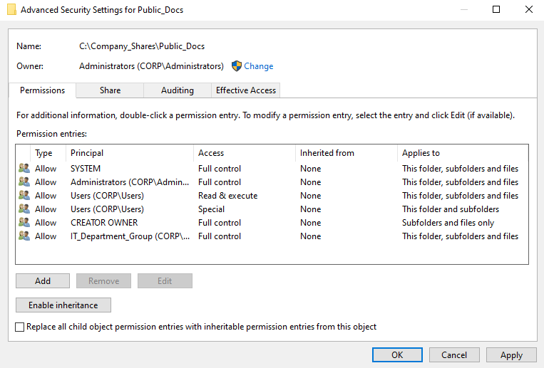

---

### Step 3: Desktop Lockdown GPO Creation
Group policy management is enforced through the main server such as blocking the control panel and command prompt. I went with the basic settings for the added security which can be readjusted through the user configuration. 

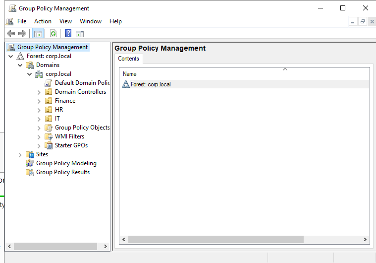

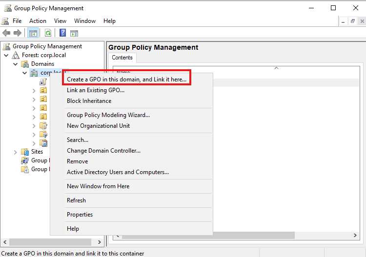

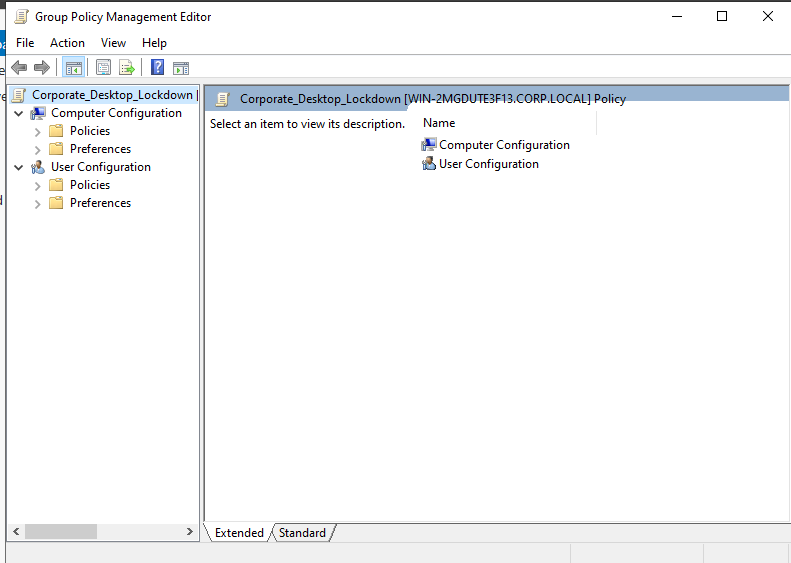

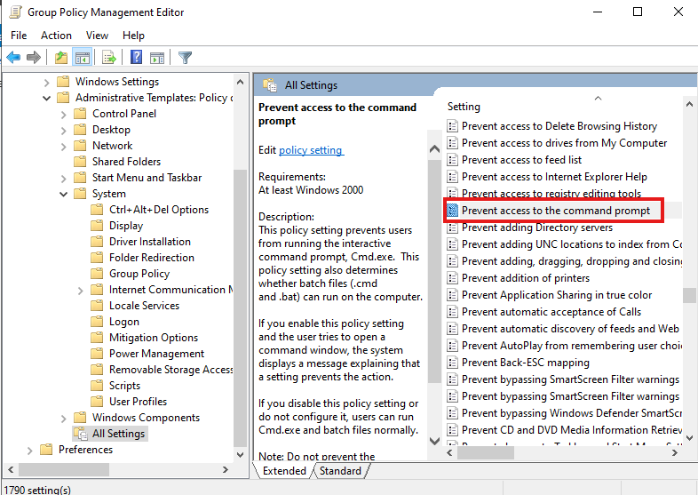

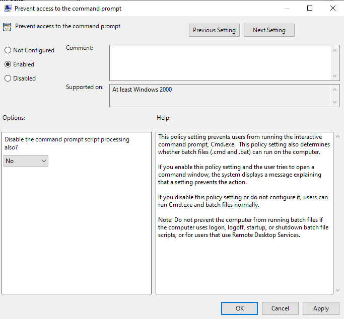

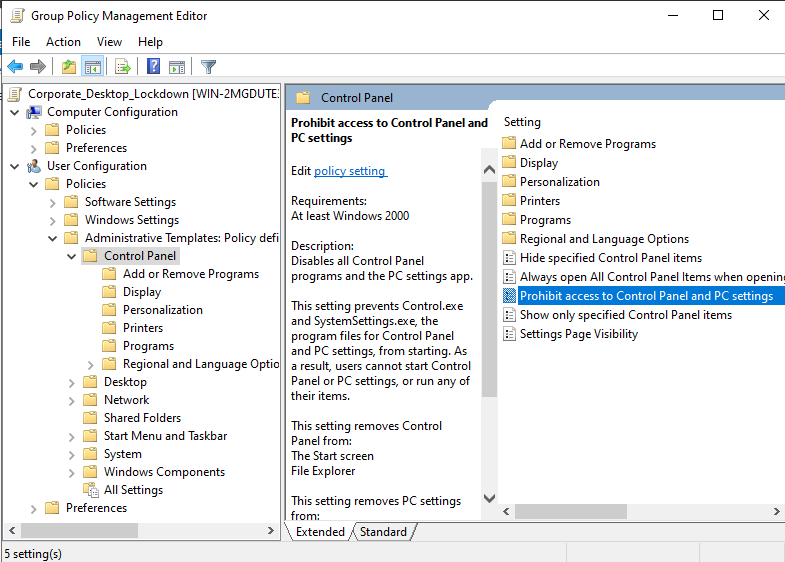

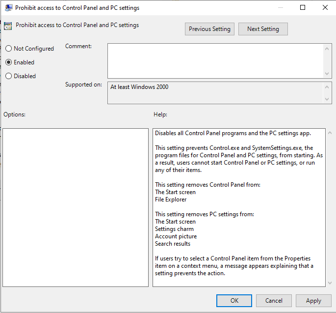

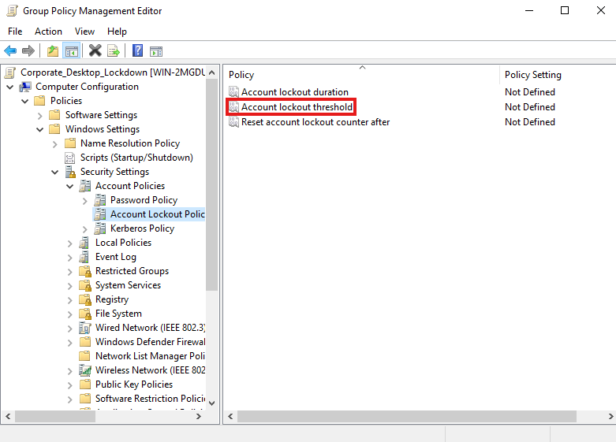

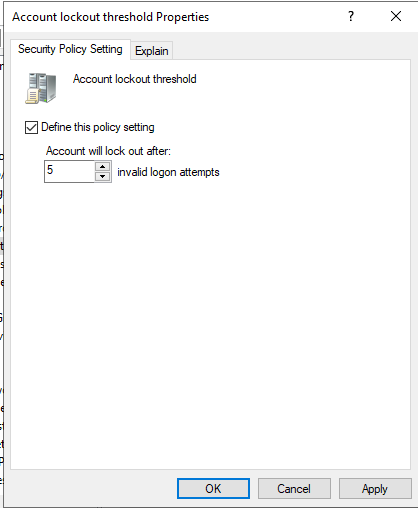

---

### Step 4: Network Drive Mapping
The public folder that shows up across each user is created through the Group Policy Editor. The server static IP is necessary to ensure the public documents folder is visible to the users.

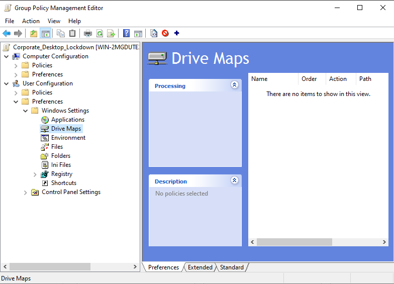

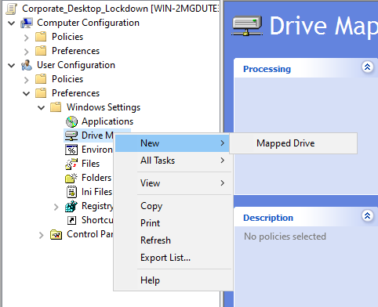

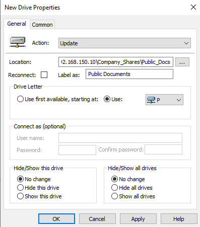

---

### Step 5: User Testing
Before completion of the project, it's imperative to test the policies from the user perspective to make sure each one works as intended. In my case, I was still able to create documents while logged as a HR user and had to backtrack to delete special user pernmissions. The command prompt restriction, control panel restriction, and text document creation were tested.

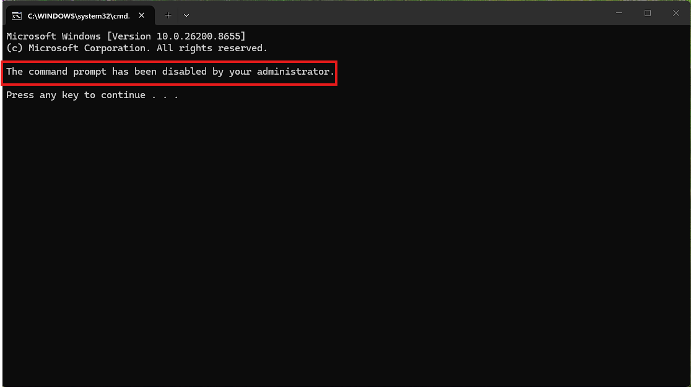

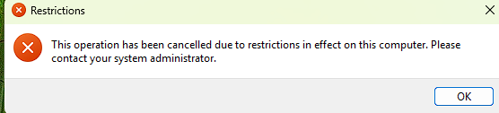

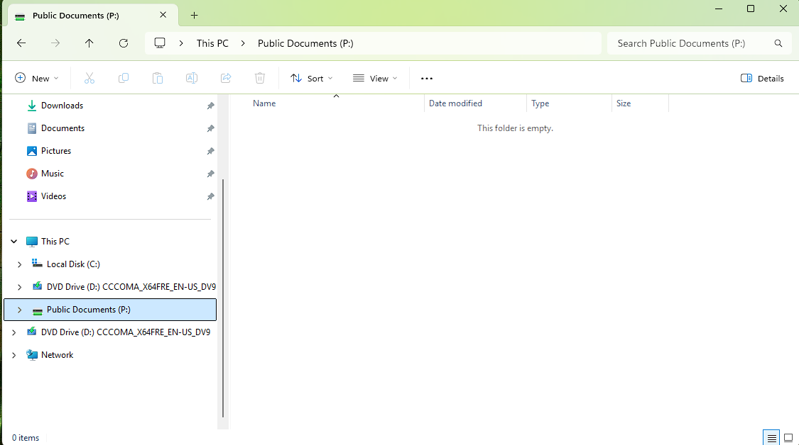

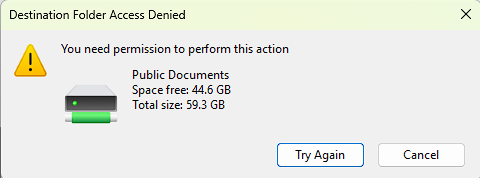
